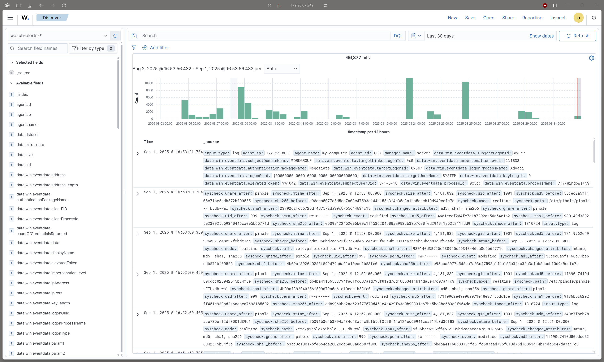
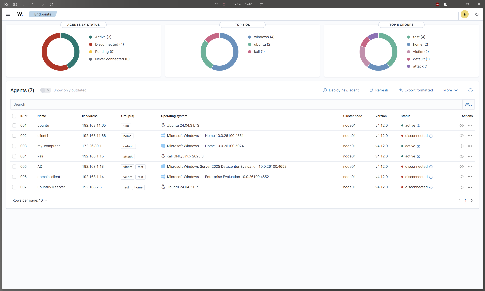
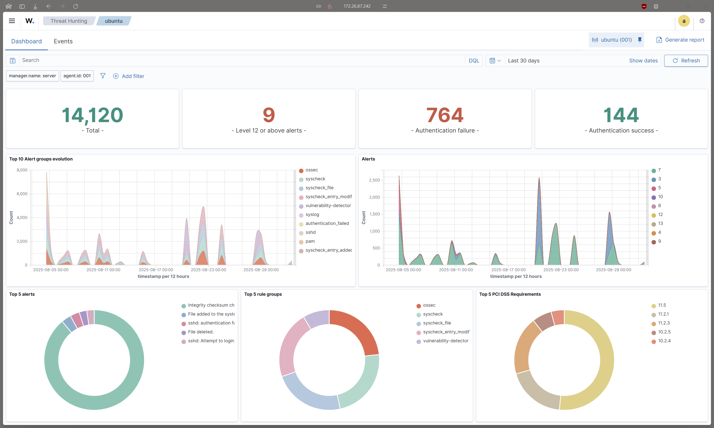
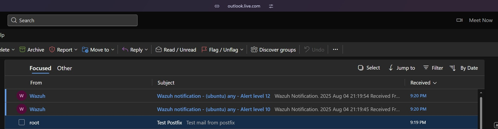

# Wazuh SIEM Implementation

---

## 🛡 Project Overview
This project demonstrates the implementation of a **Security Information and Event Management (SIEM)** system using **Wazuh**.  
The goal was to monitor and secure endpoints, detect threats, and generate actionable alerts.

**Key Features:**
- Integration of **Windows and Linux endpoints** with Wazuh agents.
- **Malware detection** via VirusTotal integration.
- **Automated email alerts** based on risk levels.
- Centralized logging for **security analysis and monitoring**.

---

## 🖥 Architecture

### Topology Diagram

**Components:**
- **Wazuh Server** – Deployed on WSL Ubuntu. Handles log collection, analysis, and alerting.  
- **Agents** – Windows 11 host, Kali VM, and Ubuntu server configured to send logs to Wazuh server.  
- **Integration** – VirusTotal API used for malware threat detection.  
- **Notifications** – Email alerts triggered for high-risk events.

---

## 📊 Monitoring & Alerts

### Example Alerts Dashboard

- Logs are categorized by **risk level** (Low, Medium, High).  
- Email notifications are sent automatically when **high-risk threats** are detected.  
- Centralized dashboards allow **real-time monitoring** of security events.

---

## ⚙️ Implementation Details

1. **Wazuh Server Setup** all-in-one
   - Installed on **Ubuntu WSL** within the WIN11 host machine.
2. **Agent Deployment**
   - Windows 11 host, Windows Server 2025 VM and Kali Linux VM connected as agents.
   - Configured log forwarding and monitoring policies.
3. **VirusTotal Integration**
   - Enabled malware detection for all file events.
   - Alerts categorized based on VT risk score.
4. **Email Notifications**
   - Configured **SMTP settings** for alert delivery.
   - Alerts are filtered by **risk severity** to avoid alert fatigue.

---

## 📸 Screenshots

### Agent Status

### Security Events Overview

### Email Alert Example

---

## ✅ Key Learnings
- Hands-on experience deploying **SIEM infrastructure** in a lab environment.  
- Understanding of **endpoint monitoring, log collection, and alerting workflows**.  
- Integration with **external threat intelligence (VirusTotal)**.  
- Experience in **configuring automated notifications** based on risk levels.

---

## 🔗 Related Projects
- [Active Directory Lab](../ad-lab/)  
- [Pi-hole DNS Filtering Lab](../pi-hole-lab/)
